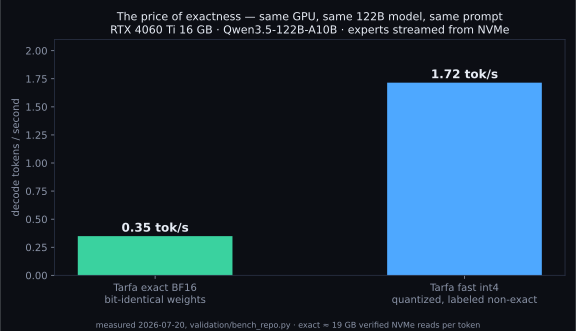
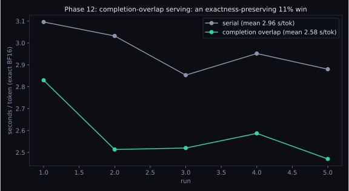
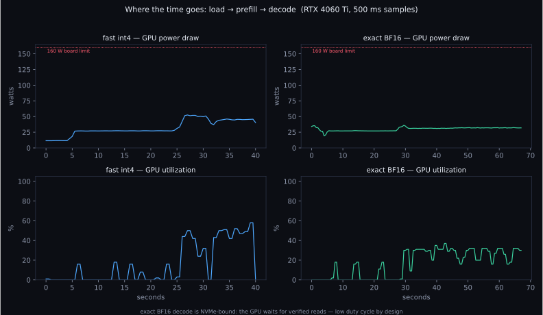
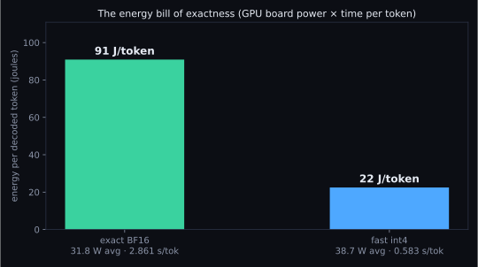

# Benchmarks: the honest version

Every number here was measured on this repo's code (`validation/bench_repo.py`), on the actual
target machine, with the JSON receipts committed in `validation/`.

**The machine:** one RTX 4060 Ti (16 GB, ~$400), PCIe 4 NVMe, 31 GB RAM. That's the whole point,
this is the hardware people actually have.

## 1. The price of exactness (same GPU, same model, same prompt)



| mode | decode | load | VRAM | weights |
|---|---|---|---|---|
| **exact BF16** (default) | **0.35 tok/s** (2.86 s/tok) | 22 s | 12.4 GB | bit-identical to checkpoint |
| **fast int4** (labeled) | **1.81 tok/s** (0.55 s/tok) | 21 s | 12.4 GB | int4 symmetric, per-row fp16 scale |

Exactness costs ~5x in speed (fast-mode runs measured 1.4 to 1.8 tok/s depending on cache warmth; the committed receipt is the number in the table), because exact mode streams **~19 GB of verified BF16 expert weights
from NVMe per decoded token** while int4 moves an eighth of that. We think 0.35 tok/s for a
bit-identical 122B on a $400 GPU is remarkable; we also think you deserve to know it's 0.35 and
not "up to 2".

A detail worth reporting because it cuts both ways: on this benchmark prompt, the fast int4 mode's
greedy continuation **matched exact BF16 token-for-token**. Quantization often agrees. But our own
Phase 9 audit proved it doesn't always, batched-verification numerics diverge from single-token
decode, which is precisely why fast mode carries a permanent label instead of a footnote.

## 2. What 0.35 tok/s actually buys you

Slow is a fact; what matters is what the slowness purchases. In exact mode, every decoded token is
produced by the checkpoint's own BF16 weights, read and verified from disk, through the model's
native top-8 router, with fp32 logits. There is no quantized cousin standing in for the model.
For model auditing, interpretability research, and reproducible evaluation (any work where the
object of study must *be* the model) that property isn't a nice-to-have; it's the prerequisite.
Elsewhere, engines get their speed by quietly not having it. Tarfa has it by default and posts the
bill: 2.86 seconds per token on a $400 GPU. When you don't need the guarantee, the labeled fast
mode gives the speed back.

## 3. Where the exact-mode speed came from (and what was rejected)



Serving-level completion overlap took exact decode from 2.95 to 2.63 s/tok (−11%) with zero
numeric change: the kind of win we accept. The full ledger of accepted **and rejected** ideas
(a 1.8 GB cache with a 3.3% hit rate; a RAM arena that saved 24.7 GB of NVMe traffic and still
lost 9.9% end-to-end; speculative decoding demoted for greedy divergence) lives in
[EXACTNESS.md](EXACTNESS.md). Benchmarks that only show the wins are marketing.

## Reproduce

```bash
cd tarfa
python validation/bench_repo.py            # fast int4
BF16=1 python validation/bench_repo.py     # exact BF16
```

Receipts: `validation/bench_fast_int4.json`, `validation/bench_exact_bf16.json`,
`validation/phase12/*.json`.

## 4. Power and utilization: the GPU is not the engine room



Sampled at 500 ms with `nvidia-smi` during the runs above. The number that surprises people:
**GPU utilization averages ~26% in both modes, at 32–39 W on a 160 W card.** Tarfa is not
compute-bound; the GPU spends most of each token waiting for expert weights to arrive from NVMe.
The bottleneck is the storage path, which is exactly why the engineering effort went into preads,
pinned buffers, and transport overlap rather than kernels.



| mode | avg board power | GPU util | energy per token |
|---|---|---|---|
| exact BF16 | 31.8 W | 25.9% | **90.9 J** |
| fast int4 | 38.7 W | 25.7% | **22.5 J** |

Exactness costs ~4× the energy per token, not because it draws more power (it draws *less*),
but because each token takes longer. Receipts: `validation/power_metrics.json`.
